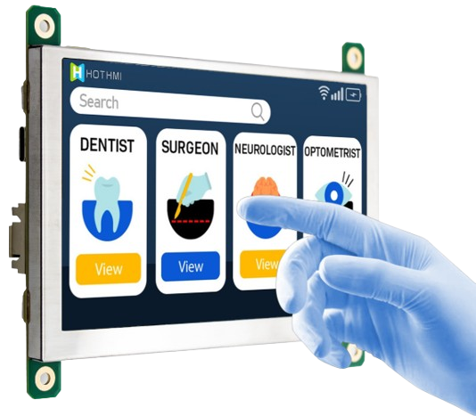
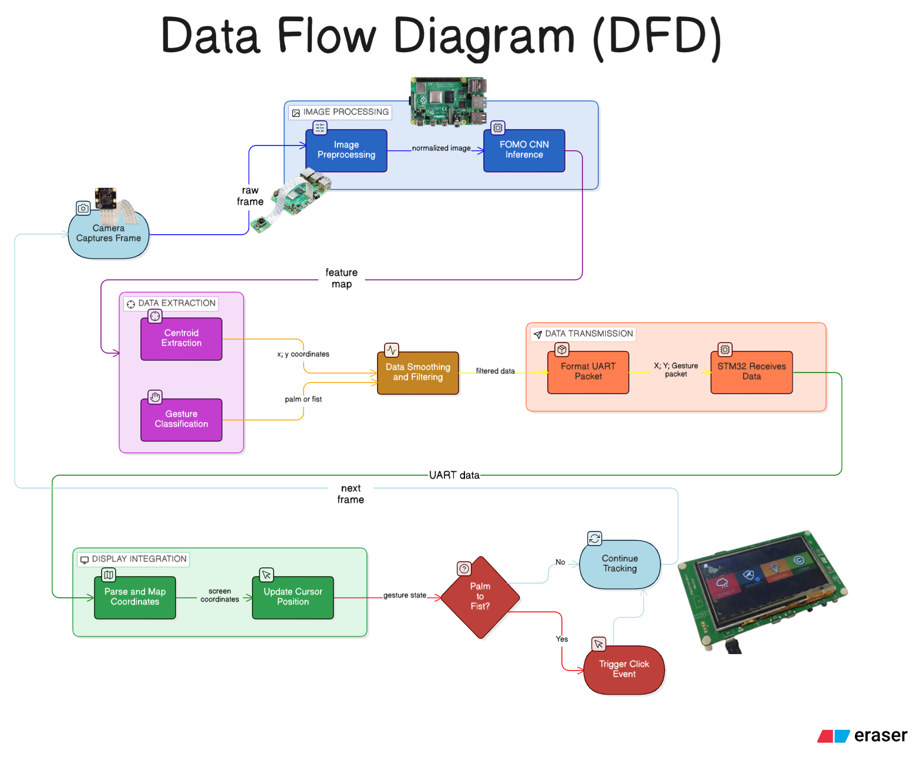
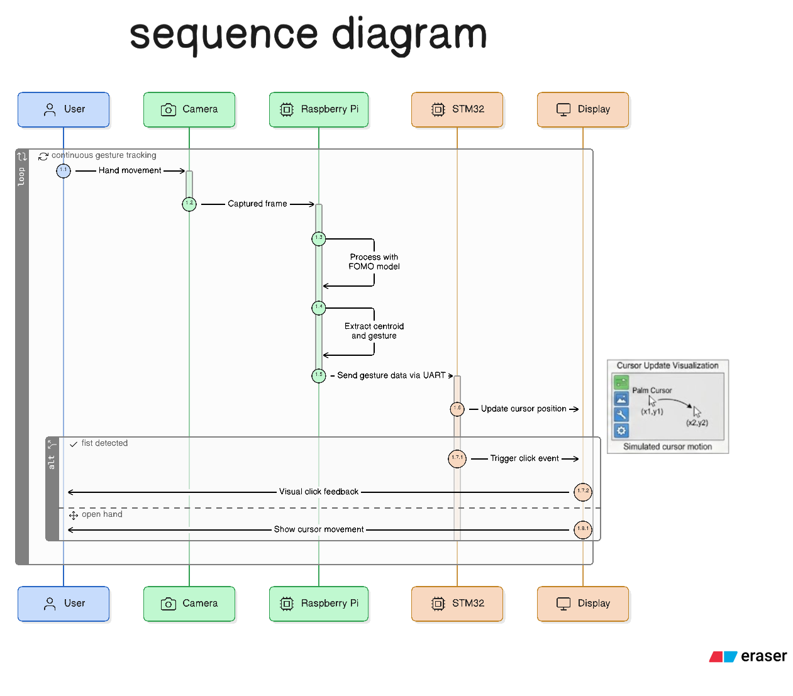
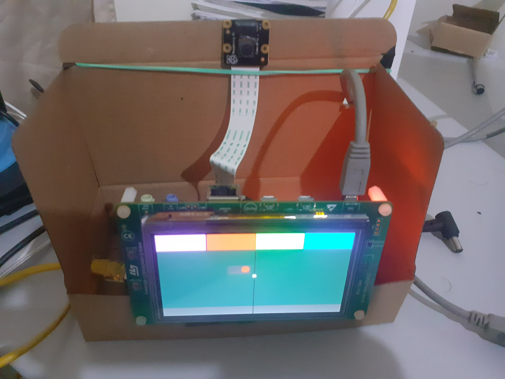
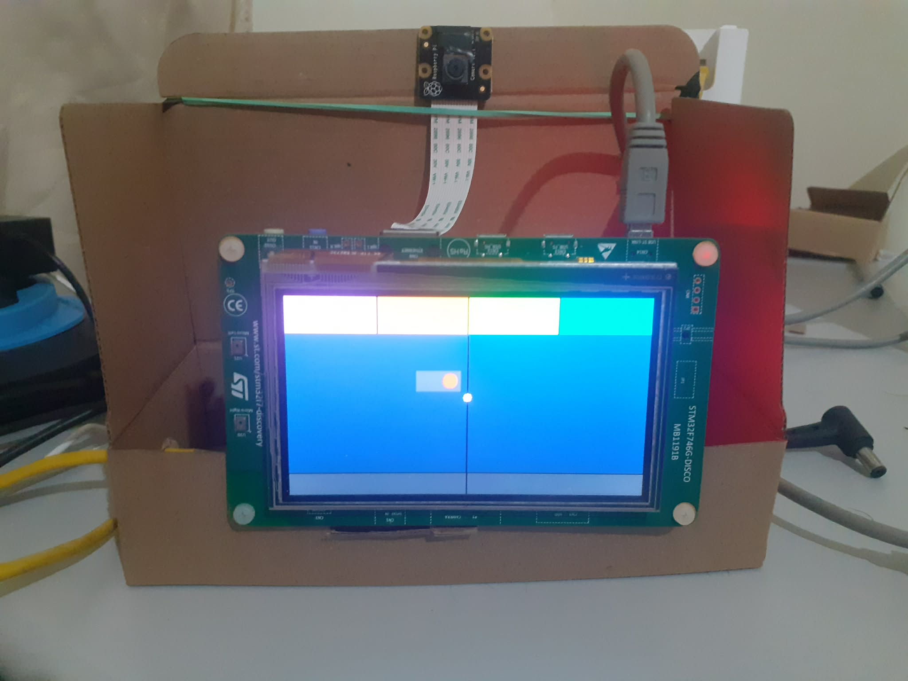
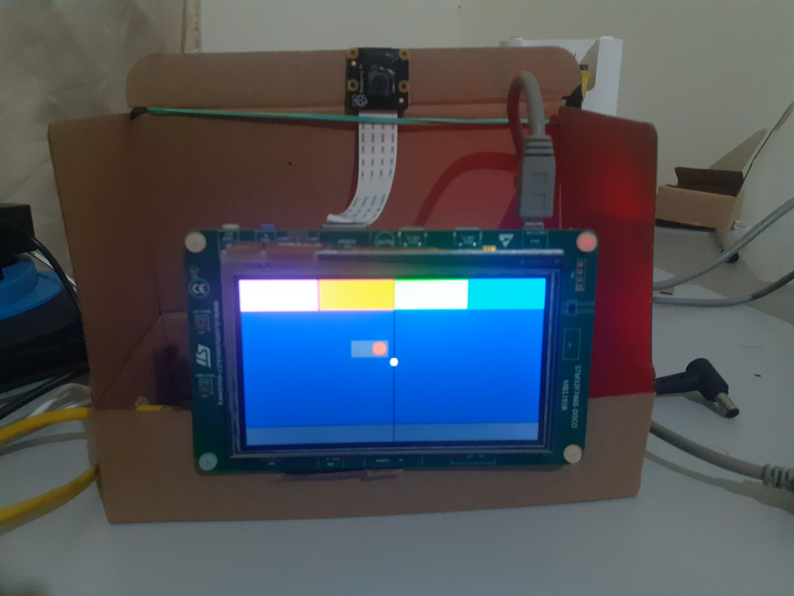
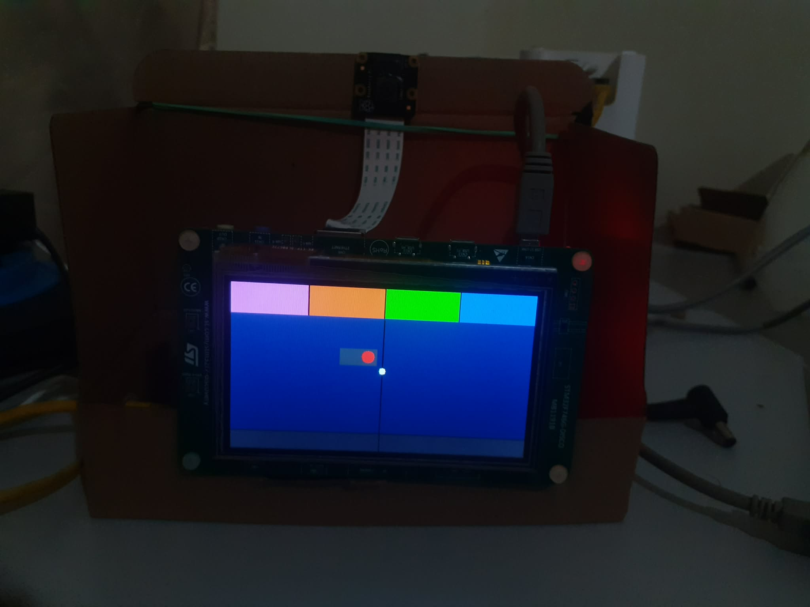
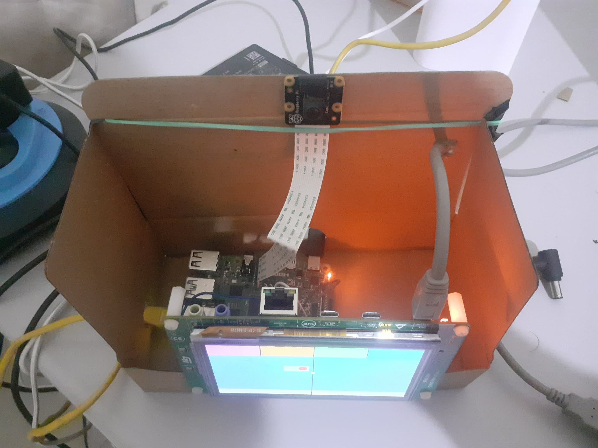

# P2M – Edge AI Gesture-Controlled Industrial HMI System


> A real-time Edge AI-based touchless Human-Machine Interface (HMI) for industrial environments — control dashboards with hand gestures, no physical contact required.

---

## 📌 Table of Contents

- [Overview](#overview)
- [Problem Statement](#problem-statement)
- [Proposed Solution](#proposed-solution)
- [System Architecture](#system-architecture)
- [Hardware Components](#hardware-components)
- [AI Model](#ai-model)
- [Dataset](#dataset)
- [System Workflow](#system-workflow)
- [HMI & UI Design](#hmi--ui-design)
- [Communication Architecture](#communication-architecture)
- [Real-Time UART Protocol](#-real-time-uart-protocol-ai--stm32)
- [Current Interaction Model](#-current-interaction-model-hmi-phase-2)
- [Performance & Optimization](#performance--optimization)
- [Technologies & Tools](#technologies--tools)
- [Current Status](#current-status)
- [Future Improvements](#future-improvements)
- [Author](#author)

---
## Overview

**P2M** is a gesture-controlled embedded HMI system that allows operators to interact with an industrial dashboard using hand gestures instead of physical buttons or touchscreens.

The project combines:

- 🤖 **Computer Vision**
- 🔌 **Embedded Systems**
- 🧠 **Edge AI**
- 📡 **Real-Time Communication**
- 🖥️ **Graphical User Interfaces**

Built on a distributed architecture using a **Raspberry Pi 4** for AI inference and an **STM32F747I Discovery Kit** for HMI rendering.

---

## 🎯 Problem Statement

<table>
<tr>
<td valign="top" width="55%">

Traditional industrial HMIs rely on physical interaction (buttons, touchscreens), introducing several limitations:

- Physical contact in harsh or contaminated environments
- Reduced usability when operators wear gloves
- Limited interaction flexibility
- Hygiene and maintenance concerns
- Poor ergonomics in repetitive interaction scenarios

A contactless, intelligent interaction system is needed to improve usability, flexibility, and operator experience in industrial settings.

</td>
<td valign="middle" width="45%" >



</td>
</tr>
</table>

---

## 🚀 Proposed Solution

This project introduces a **gesture-controlled embedded HMI system** based on real-time computer vision and Edge AI. The system detects hand gestures via camera and translates them into interaction events:

- 🖱️ Cursor movement
- 🧭 Navigation
- 🖱️ Click actions

### Example Use Case

An operator interacts with an industrial dashboard without ever touching the screen:

| Gesture | Action          |
| ------- | --------------- |
| 🖐 Palm | Cursor movement |
| ✊ Fist | Click / Select  |

Example dashboard elements:

- 🌡 Temperature monitoring
- ⚙ Motor speed control
- ✅ Machine status visualization
- 📊 Industrial process navigation

---

## 🏗️ System Architecture

```
Pi NoIR Camera V2
        ↓
Raspberry Pi 4
(FOMO Edge AI Inference)
        ↓ UART
STM32F747I Discovery Kit
(TouchGFX HMI + LTDC Rendering)
        ↓
Industrial Dashboard Display
```

---

## 🗂 System Diagrams

### Data Flow Diagram



### Sequence Diagram



---

## Video demo
https://github.com/user-attachments/assets/d7f16bd4-3603-435d-9a10-8a7372e2ee09


### 📸 System Snapshots

<div align="center">
<table>
<tr>
  <td ></td>
  <td ></td>
</tr>
</table>
</div>
<div align="center">
<table>
<tr>
  <td></td>
  <td></td>
  <td></td>
</tr>

</table>
</div>
---

## 🔧 Hardware Components

| Component                | Purpose                       |
| ------------------------ | ----------------------------- |
| Raspberry Pi 4 Model B   | Edge AI inference             |
| Pi NoIR Camera V2        | Real-time image acquisition   |
| STM32F747I Discovery Kit | HMI control and rendering     |
| LTDC TFT Display         | Dashboard visualization       |
| UART Interface           | Communication between systems |

---

## 🧠 AI Model

### Model Type

- **FOMO** (Faster Objects, More Objects) — a lightweight CNN-based object detection architecture built on **MobileNetV2**

### Training Platform

- [Edge Impulse Studio](https://edgeimpulse.com)

### Model Capabilities

- Hand detection
- Gesture classification
- Centroid extraction (x, y)

### Gesture Classes

| Class      | Description                 |
| ---------- | --------------------------- |
| Palm       | Open hand — cursor movement |
| Fist       | Closed hand — click/select  |
| Background | No hand detected            |

---

## 📂 Dataset

A custom dataset was created and manually annotated using **Edge Impulse**.

| Property        | Details  |
| --------------- | -------- |
| Training images | ~500     |
| Testing images  | ~80      |
| Class balance   | Balanced |

**Variations included:**

- Different hand positions
- Multiple lighting conditions
- Different scales and distances
- Various backgrounds
- Partial hand visibility

---

## ⚙️ System Workflow

```
1. Image Acquisition    →  Camera captures real-time frames
2. AI Inference         →  Raspberry Pi runs FOMO model on each frame
3. Feature Extraction   →  Gesture class + hand centroid (x, y) extracted
4. Signal Processing    →  EMA smoothing + gesture debouncing
5. Communication        →  Data sent via UART
                           Format: <x,y,gesture>
6. Embedded Processing  →  STM32 parses data, maps to screen, triggers events
7. UI Rendering         →  TouchGFX renders dashboard via LTDC
```

---

## 🖥️ HMI & UI Design

The graphical interface was developed using the **TouchGFX** embedded GUI framework.

**Features:**

- Real-time cursor rendering
- Interactive dashboard navigation
- Embedded graphical components
- Industrial-style UI design

---

## 🔄 Communication Architecture

**Protocol:** UART

| Parameter  | Value                      |
| ---------- | -------------------------- |
| Connection | Raspberry Pi TX → STM32 RX |
| Baudrate   | 115200                     |

**Data Transmitted:**

- X coordinate
- Y coordinate
- Gesture state

**Packet format:**

```
<X:120,Y:85,G:PALM>
```

---

## 📡 Real-Time UART Protocol (AI → STM32)

The Raspberry Pi sends real-time gesture tracking data to the STM32 using UART.

### 📦 Packet Format

```
<x,y,gesture>
```

### 📌 Example Packets

```
120,80,1
200,140,0
```

| Field   | Description                  |
| ------- | ---------------------------- |
| x       | Hand centroid X (FOMO space) |
| y       | Hand centroid Y (FOMO space) |
| gesture | 1 = palm, 0 = fist           |

---

### ⏱ Transmission Rate

- UART send interval: **30 ms (~33 Hz)**
- Controlled in Python using:

```python
SEND_INTERVAL = 0.03
```

### ⚙️ Processing Pipeline

**Raspberry Pi:**

```
AI detection → filtering → centroid extraction → UART packet
```

**STM32:**

```
UART RX → parse packet → scale coordinates → update cursor → detect gesture event
```

---

## 🧠 Current Interaction Model (HMI Phase 2)

The system now supports real-time touchless interaction.

### 🖐 Gesture Mapping

| Gesture | Action                       |
| ------- | ---------------------------- |
| Palm    | Cursor movement              |
| Fist    | Click event (edge-triggered) |

---

### 🖱 Click Detection Logic

A click is detected **only** on a `Palm → Fist` transition.

This prevents repeated click triggering during sustained fist gestures.

---

### 🎯 UI Interaction

- Cursor moves in real-time over LCD
- Collision detection with UI elements (buttons/switches)
- Toggle interaction implemented (ON/OFF switch)

---

### ⚡ Rendering Strategy

| Strategy                   | Used |
| -------------------------- | ---- |
| Full-screen redraw         | ❌   |
| Partial framebuffer update | ✅   |

- Only the cursor area (~100 pixels) is updated per frame
- LTDC continuously scans SDRAM framebuffer

---

## ⚡ Performance & Optimization

### Latency Breakdown

| Block                               | Estimated Latency |
| ----------------------------------- | ----------------- |
| AI Detection Loop (Pi Runtime)      | ~3–4 ms           |
| AI Inference + Detection Pipeline   | ~30–60 ms         |
| UART Transmission                   | ~1–2 ms           |
| STM32 Packet Parsing                | < 1 ms            |
| Coordinate Scaling & Mapping        | < 1 ms            |
| Partial Framebuffer Redraw          | < 5 ms            |
| **Total End-to-End System Latency** | **~35–70 ms**     |

> 🖱 Effective cursor update rate: **~33 Hz**
> (limited intentionally by the 30 ms UART transmission interval)

---

### Optimization Techniques

- INT8 quantization
- Lightweight FOMO architecture
- Reduced input resolution
- UART rate limiting (~33 Hz)
- Partial framebuffer rendering
- Cursor-only redraw regions
- Coordinate smoothing (EMA / low-pass filter)
- Interrupt-driven UART reception
- SDRAM framebuffer acceleration via LTDC

---

## 🧰 Technologies & Tools

### Software

| Tool                | Purpose                     |
| ------------------- | --------------------------- |
| Python              | Raspberry Pi scripting      |
| Edge Impulse Studio | Model training & deployment |
| TensorFlow Lite     | On-device inference         |
| STM32CubeIDE        | Firmware development        |
| STM32CubeMX         | Peripheral configuration    |
| TouchGFX            | Embedded GUI design         |
| FreeRTOS            | Real-time task management   |
| VNC Viewer          | Remote Pi access            |
| Minicom             | UART text interface         |

### Concepts

Edge AI · Computer Vision · CNNs · Embedded Systems · Real-Time Systems · UART Communication · LTDC Graphics · Signal Processing · Framebuffer Rendering · Coordinate Scaling

---

## 📊 Current Status

### ✅ Completed

- Edge AI gesture detection (Raspberry Pi)
- UART real-time communication pipeline
- STM32 UART interrupt-driven receiver
- Coordinate scaling (AI → LCD mapping: 96×96 → 480×272)
- Smooth cursor motion (low-pass filter)
- Partial framebuffer rendering (optimized graphics)
- Cursor save/restore mechanism for efficient redraw
- Static industrial HMI layout (top bar, main area, bottom navigation)
- Interactive UI element (toggle switch with collision detection)
- Gesture-based click system (Palm → Fist edge detection)

### 🚧 Current Phase

👉 **Phase 2: AI-driven real-time cursor HMI**

The system has transitioned from:

```
Static framebuffer rendering  →  Interactive GUI system
```

Now supporting:

- Real-time cursor movement driven by AI centroid
- Gesture-based interaction (click on Palm → Fist transition)
- UI element activation (toggle switch)

---

## 🔮 Future Improvements

- Additional gesture classes (swipe, zoom, rotate)
- Multi-element UI interaction
- Wireless communication (Wi-Fi / BLE) replacing UART
- Feedback mechanisms (haptic / audio)
- Deployment on additional embedded targets

---

## 👨‍💻 Author

**Melek Fourati**

---

> _This project demonstrates how Edge AI, embedded systems, and computer vision can be combined to build a modern contactless industrial HMI — transforming traditional interaction into a real-time intelligent experience._
