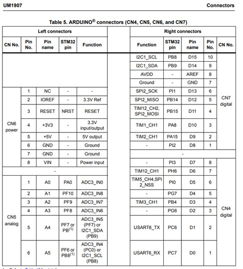
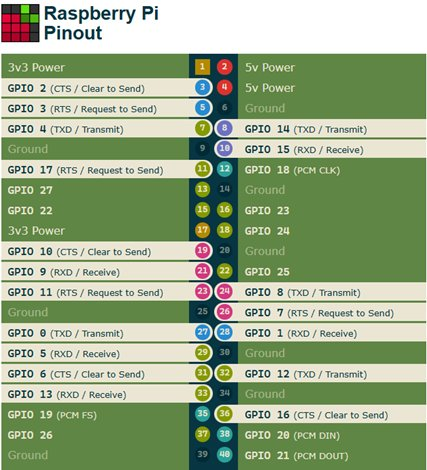

# UART Communication: STM32F746G-DISCO ↔ Raspberry Pi 4

> **Serial communication bridge between an STM32F746 Discovery board and a Raspberry Pi 4 using USART6 (PC6/PC7) on the Arduino connector pins D1/D0.**

---

## Table of Contents

1. [Overview](#overview)
2. [Hardware Requirements](#hardware-requirements)
3. [Why USART6?](#why-usart6)
4. [STM32 Configuration (STM32CubeMX)](#stm32-configuration-stm32cubemx)
5. [Pin Mapping: STM32F746G-DISCO Board](#pin-mapping-stm32f746g-disco-board)
6. [Hardware Wiring](#hardware-wiring)
7. [Raspberry Pi 4 UART Setup](#raspberry-pi-4-uart-setup)
8. [Fixing ttyS0 → ttyAMA0 (Full UART)](#fixing-ttys0--ttyama0-full-uart)
9. [Verification](#verification)
10. [Troubleshooting](#troubleshooting)

---

## Overview

This guide documents how to establish a **UART serial communication link** between:

- **STM32F746G-DISCO** (Discovery kit with STM32F746NG MCU)
- **Raspberry Pi 4** (running Raspberry Pi OS)

The communication uses **USART6** on the STM32 side (routed to the Arduino-compatible connector) and the **GPIO hardware UART** (`ttyAMA0`) on the Raspberry Pi side.

> ⚠️ **Important:** Both devices operate at **3.3V logic levels**. Do **not** use 5V signals — this will damage the STM32 GPIO pins.

---

## Hardware Requirements

| Component | Details |
|---|---|
| MCU Board | STM32F746G-DISCO (STM32F746NG) |
| SBC | Raspberry Pi 4 Model B |
| Wires | 3× Male-to-Female jumper wires |
| Power | Both boards powered independently |

---

## Why USART6?

The STM32F746G-DISCO board exposes two main USART peripherals accessible without hardware modification:

| Peripheral | TX Pin | RX Pin | Routed To | Usable? |
|---|---|---|---|---|
| **USART1** | PA9 | PB7 | ST-LINK VCP (USB debug port) | ⚠️ Conflicts with debugger |
| **USART6** | PC6 | PC7 | Arduino connector D1/D0 | ✅ **Recommended** |

**USART1** is connected to the onboard ST-LINK debugger and is used as a Virtual COM Port for `printf` debugging over USB. Repurposing it for external communication would conflict with this functionality.

**USART6** is free for external use — its TX/RX lines are routed to the standard Arduino Uno V3 header pins **D1** and **D0**, making it ideal for connecting to the Raspberry Pi.

Both USART1 and USART6 are clocked from the APB2 high-speed bus, so they offer identical maximum baud rate performance.

---

## STM32 Configuration (STM32CubeMX)

### USART6 Parameter Settings

Configure USART6 with the following parameters in **STM32CubeMX → Connectivity → USART6**:


#### Mode

| Setting | Value |
|---|---|
| Mode | **Asynchronous** |
| Hardware Flow Control (RS232) | Disabled |
| Hardware Flow Control (RS485) | Disabled |

#### Basic Parameters

| Parameter | Value |
|---|---|
| Baud Rate | `115200 Bits/s` |
| Word Length | `8 Bits (including Parity)` |
| Parity | `None` |
| Stop Bits | `1` |

#### Advanced Parameters

| Parameter | Value |
|---|---|
| Data Direction | `Receive and Transmit` |
| Over Sampling | `16 Samples` |
| Single Sample | `Disable` |

#### Advanced Features

| Feature | Value |
|---|---|
| Auto Baudrate | Disable |
| TX Pin Active Level Inversion | Disable |
| RX Pin Active Level Inversion | Disable |
| Data Inversion | Disable |
| TX and RX Pins Swapping | Disable |
| Overrun | Enable |
| DMA on RX Error | Enable |

---

## Pin Mapping: STM32F746G-DISCO Board

The STM32F746G-DISCO board uses **Arduino Uno V3 compatible connectors**. The relevant connectors for UART are shown below.

### Arduino Connectors Overview (from UM1907 User Manual)



The board exposes connectors **CN4, CN5, CN6, CN7**. USART6 is accessible via **CN4 (digital)**:

| Arduino Pin | Board Connector | STM32 Pin | USART6 Function |
|---|---|---|---|
| **D0** | CN4 – Pin 1 | **PC7** | USART6_RX |
| **D1** | CN4 – Pin 2 | **PC6** | USART6_TX |
| GND | CN7 – Pin 7 | GND | Common ground |

> These are the physical pins to use on the STM32 board for the UART wires.

---

## Hardware Wiring

> ⚠️ **3.3V logic only — never connect to 5V Pi pins!**

The connection follows a **cross-wired TX→RX** pattern:

| STM32F746G-DISCO | Raspberry Pi 4 | Direction |
|---|---|---|
| **PC6 / D1** (USART6_TX) | **GPIO 15** (UART RX, Pin 10) | STM32 TX → Pi RX |
| **PC7 / D0** (USART6_RX) | **GPIO 14** (UART TX, Pin 8) | STM32 RX ← Pi TX |
| **GND** (CN7) | **GND** (any, e.g. Pin 7) | Common ground |

### Raspberry Pi 4 GPIO Pinout Reference



The relevant GPIO pins for UART0 (PL011 / ttyAMA0) are:

- **GPIO 14** → Physical Pin 8 → **TXD / Transmit**
- **GPIO 15** → Physical Pin 10 → **RXD / Receive**

### Wiring Diagram Summary

```
STM32F746G-DISCO                    Raspberry Pi 4
  CN4 - D1 (PC6 / TX) ──────────→  GPIO 15 / Pin 10 (RX)
  CN4 - D0 (PC7 / RX) ←──────────  GPIO 14 / Pin 8  (TX)
  CN7 - GND           ────────────  GND / Pin 6
```

---

## Raspberry Pi 4 UART Setup

### Step 1 — Enable the Serial Port

Run `raspi-config` to enable the hardware UART:

```bash
sudo raspi-config
```

Navigate to:

```
Interface Options → Serial Port
  → Login shell over serial?  → No
  → Serial port hardware enabled? → Yes
```

After this, reboot:

```bash
sudo reboot
```

### Step 2 — Verify the Serial Device

After rebooting, check which device `/dev/serial0` points to:

```bash
ls -l /dev/serial0
```

**Desired output:**

```
/dev/serial0 -> ttyAMA0   ✅
```

If you see `ttyS0` instead, see the next section.

---

## Fixing ttyS0 → ttyAMA0 (Full UART)

### The Problem

On Raspberry Pi 4, by default:

- **Bluetooth** is assigned to the full hardware UART (`ttyAMA0` / PL011)
- The GPIO UART pins (14/15) are assigned to the **mini UART** (`ttyS0`)

The mini UART (`ttyS0`) is weaker and less stable — its baud rate depends on the CPU clock, which can drift. For reliable UART communication at 115200 baud, you need `ttyAMA0`.

### The Fix

Edit the boot config file:

```bash
sudo nano /boot/firmware/config.txt
```

Add these lines at the **end** of the file:

```ini
[all]
enable_uart=1
dtoverlay=disable-bt
```

Save with `Ctrl+O`, exit with `Ctrl+X`, then reboot:

```bash
sudo reboot
```

### What This Does

| Action | Effect |
|---|---|
| `enable_uart=1` | Ensures the hardware UART is enabled at boot |
| `dtoverlay=disable-bt` | Detaches Bluetooth from the PL011 UART hardware |

After this, the GPIO pins (14/15) are reassigned to the full `ttyAMA0` hardware UART, giving you a stable, clock-independent serial port.

### Verify Again

```bash
ls -l /dev/serial0
# Expected: /dev/serial0 -> ttyAMA0  ✅
```


## References

- [STM32F746G-DISCO User Manual (UM1907)](https://www.st.com/resource/en/user_manual/um1907-discovery-kit-for-stm32f7-series-with-stm32f746ng-mcu-stmicroelectronics.pdf)
- [Raspberry Pi GPIO Pinout](https://pinout.xyz/pinout/uart)
- [Raspberry Pi Serial Configuration](https://www.raspberrypi.com/documentation/computers/configuration.html#configure-uarts)

---

*Last updated: May 2026*
